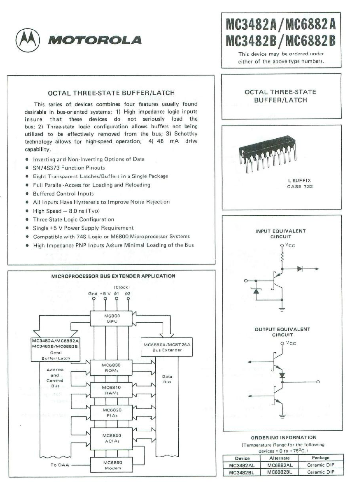

:orphan:

.. _DS-MC6882:

.. #Metadata {'Product':'MC6882 Octal Three-State Buffer/Latch','Folder': ' ','Comments':''}

MC6882 Octal Three-State Buffer/Latch
=====================================

.. note:: 

   Most likely available prior to MC6800 launch by alternate name.

.. rubric:: Collection Information

.. csv-table:: 
   :header: "Acquired"
   :widths: auto

   |notpresent|

.. rubric:: Links

:download:`MC6882 Octal Three-State Buffer/Latch <../../_static/Documents/Datasheets/DS-MC6882.pdf>`