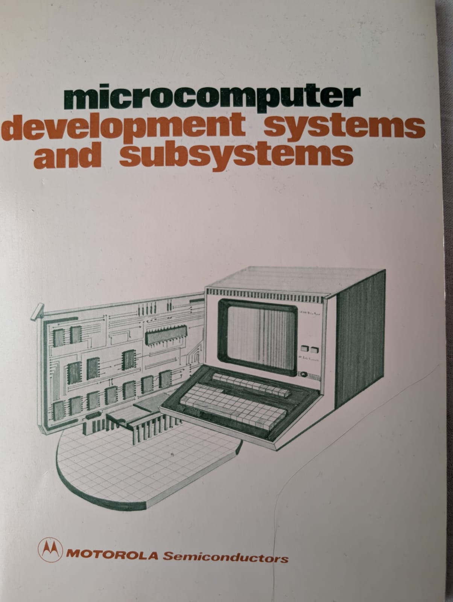

:orphan:

.. _1979_MCDS:

.. #Metadata {'Product':'Microcomputer Development Systems and Subsystems','Folder': '4','Comments':'1979'}

Microcomputer Development Systems and Subsystems
================================================

.. Note:: 
   
   This document is a collection of many datasheets, including:

   - :ref:`M68SDT EXORciser Emulator for M6800 Based Systems <DS-M68SDT-1>`
  
.. rubric:: Collection Information

.. csv-table:: 
   :header: "Acquired"
   :widths: auto

   |present| 25-MAR-2025

.. rubric:: Links

:download:`1979 Microcomputer Development Systems <../../_static/Documents/Generic/1979_Microcomputer_Development_Systems.pdf>`