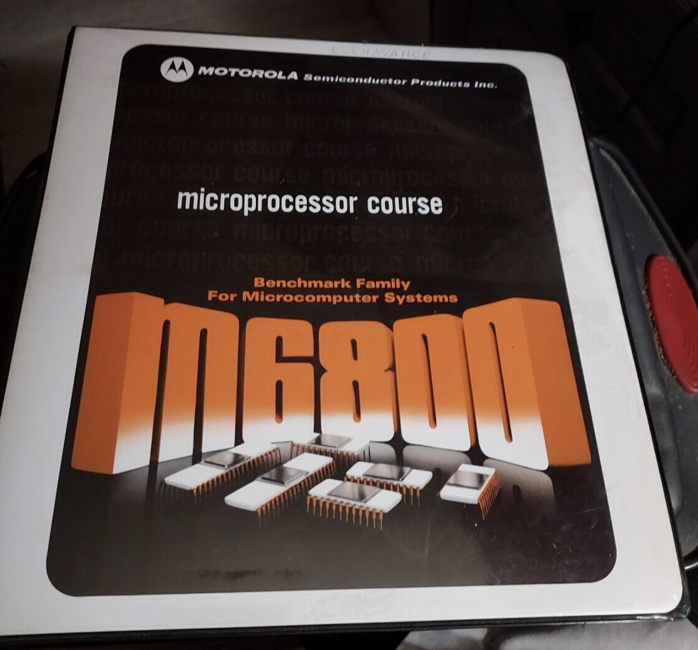

:orphan:

.. _MC6800CRSBNDR:

.. #Metadata {'Product':'Microprocessor Course','Folder': 'Microprocessor Course'}

Microprocessor Course
=====================

.. image:: ../../images/Reference/MicroprocessorCourseBinder.2.png
   :width: 400
   :align: center

.. note:: 
   
   This binder contains many other documents detailled below.

   - `M6800CNP`
   - `SYSREF`
   - `M-GE`
   - `M-PDP-11`
   - `M-MTSS`
   - `M-UCS`
   - `M-EXORcser`

.. rubric:: Collection Information

.. csv-table:: 
   :header: "Acquired"
   :widths: auto

   |present| 31-MAR-2025
