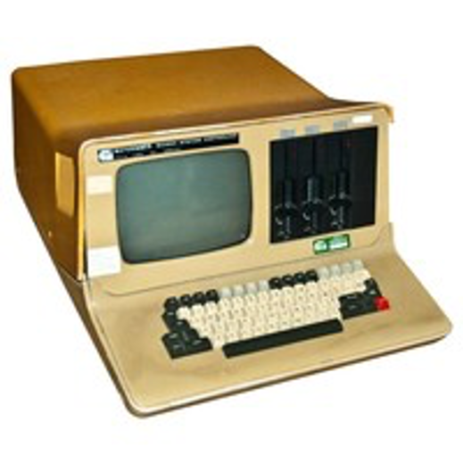

:orphan:

.. _EXORSET-30:

Motorola Exorset 30 Model M6809 Set 30
======================================

.. Note::

   The EXORSET 30 was created for a system of study and development primarily for professionals. It is built around a microprocessor Motorola 6809 with 64 kB of memory, backplane format EXORSISER. It is dedicated to software and hardware developments, it supports cross assembler family 6800, with a map and allows adaptation to program EPROM.

   System based on the M6809 High Performance microprocessor and MC6800 microcomputer

   .. csv-table:: 
         :header: "Specification"
         :widths: auto
            
         "32K of RAM"
         "12 E/P/ROM sockets for up to 24k bytes of user code"
         "4K bytes of monitor firmware"
         "2K bytes of alphanumeric display RAM"
         "2 User display formats:"
         "i)  80 characters per line by 22 lines"
         "ii) 40 characters per line by 16 lines"
         "128 characters in a 5x7 matrix"
         "9-inch video monitor"
         "61-key ASCII keyboard"
         "RS-232C serial interface"
         "OS - XDOS"
         "Dual BASF 6106 5.25-inch mini-FloppyDrives"
         "Enclosure:"
         "Width)  18.3 in"
         "Height) 11.0 in"
         "Length) 25.2 in"
         "Weight) 6.3 kg"
         "Manufacture Date 1982"

.. rubric:: Collection Information

.. csv-table:: 
   :header: "Acquired"
   :widths: auto

   |notpresent|

