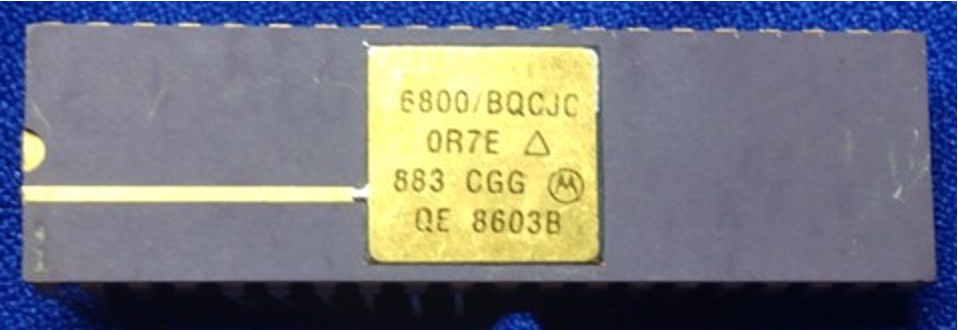

:orphan:

.. _MC6800BQCJC:

.. #Metadata {'Product':'MC6800BQCJC','Name':'MC6800BQCJC Microprocessor Unit','Storage': 'S','Drawer':0,'Row':0,'Column':0}

MC6800BQCJC Microprocessor Unit
===============================

.. rubric:: Specific Information

.. csv-table:: 
   :widths: auto

   "Date Code","TBD"
   "Manufacture Date","TBD"
   "Mask",""
   "Packaging","MIL-STD-883"
   "Status","TBD"
   "Location","TBD"
   "Temperature",""
   "Frequency",""
   "Notes",""

.. rubric:: Collection Information

.. csv-table:: 
   :header: "Acquired"
   :widths: auto

   |notpresent|

.. rubric:: Links

:download:`MC6800 DataSheet <../../../../_static/Documents/Datasheets/MC6800.pdf>`