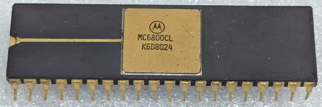

:orphan:

.. _MC6800CL:

.. #Metadata {'Product':'MC6800CL','Name':'MC6800CL Microprocessor Unit','Storage': 'Storage Box 2','Drawer':2,'Row':1,'Column':3}

MC6800CL Microprocessor Unit
============================

.. rubric:: Specific Information

.. csv-table:: 
   :widths: auto

   "Date Code","8024"
   "Manufacture Date","09-JUN-1980 to 15-JUN-1980"
   "Mask","KD6"
   "Packaging","Ceramic"
   "Status","Production"
   "Location",":ref:`Storage Box 2, Drawer 2, Row 1, Column 3 <Storage_Box_2_Drawer_2>`"
   "Temperature","-40-85\ :sup:`o`\ C"
   "Frequency","1Mhz"
   "Notes",""

.. rubric:: Collection Information

.. csv-table:: 
   :header: "Acquired"
   :widths: auto

   |present| 05-MAR-2026

.. rubric:: Links

:download:`MC6800 DataSheet <../../../../_static/Documents/Datasheets/MC6800.pdf>`