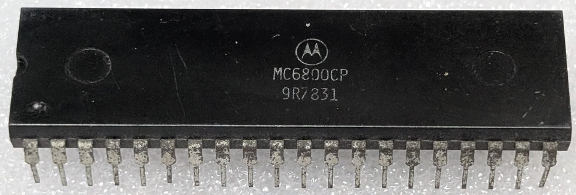

:orphan:

.. _MC6800CP:

.. #Metadata {'Product':'MC6800CP','Name':'MC6800CP Microprocessor Unit','Storage': 'Storage Box 1','Drawer':1,'Row':3,'Column':1}

MC6800CP Microprocessor Unit
============================

.. rubric:: Specific Information

.. csv-table:: 
   :widths: auto

   "Date Code","7831"
   "Manufacture Date","24-JUL-1978 to 30-JUL-1978"
   "Mask","9R"
   "Packaging","Plastic"
   "Status","Production"
   "Location",":ref:`Storage Box 1, Drawer 1, Row 3, Column 1 <Storage_Box_1_Drawer_1>`"
   "Temperature","-40-85\ :sup:`o`\ C"
   "Frequency","1Mhz"
   "Notes",""

.. rubric:: Collection Information

.. csv-table:: 
   :header: "Acquired"
   :widths: auto

   |present| 08-APR-2026

.. rubric:: Links

:download:`MC6800 DataSheet <../../../../_static/Documents/Datasheets/MC6800.pdf>`