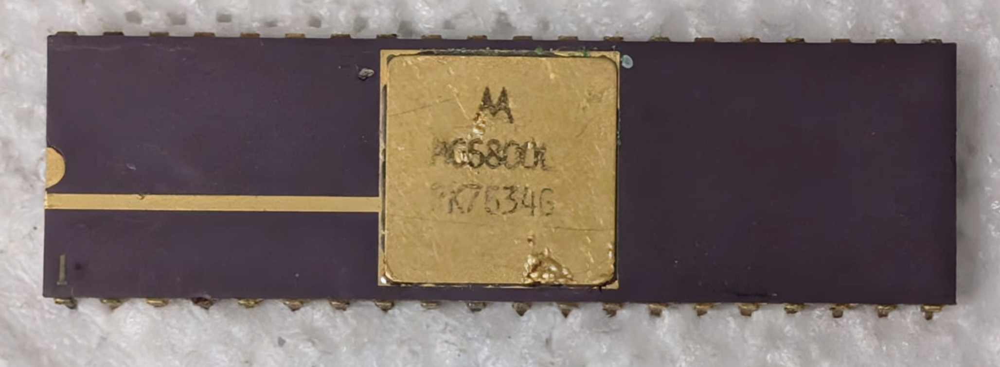

:orphan:

.. _MC6800L:

.. #Metadata {'Product':'MC6800L','Name':'MC6800L Microprocessor Unit','Storage': 'Briefcase'}

MC6800L Microprocessor Unit
===========================

.. rubric:: Specific Information

.. csv-table:: 
   :widths: auto

   "Date Code","7634"
   "Manufacture Date","16-AUG-1976 to 22-AUG-1976"
   "Mask",""
   "Packaging","Ceramic"
   "Status","Production"
   "Location",":ref:`Briefcase <Briefcase_MES6800_Briefcase_MES6800>`"
   "Temperature",""
   "Frequency",""
   "Notes",""

.. rubric:: Collection Information

.. csv-table:: 
   :header: "Acquired"
   :widths: auto

   |present| 30-JAN-2025

.. rubric:: Links

:download:`MC6800 DataSheet <../../../../_static/Documents/Datasheets/MC6800.pdf>`