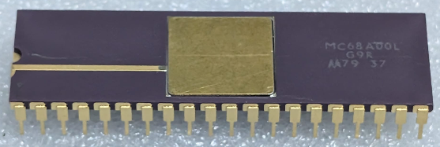

:orphan:

.. _MC68A00L:

.. #Metadata {'Product':'MC68A00L','Name':'MC68A00L Microprocessor Unit','Storage': 'Storage Box 2','Drawer':2,'Row':2,'Column':3}

MC68A00L Microprocessor Unit
============================

.. rubric:: Specific Information

.. csv-table:: 
   :widths: auto

   "Date Code","TBD"
   "Manufacture Date","TBD"
   "Mask",""
   "Packaging","Ceramic"
   "Status","Production"
   "Location","TBD"
   "Temperature","-0-70\ :sup:`o`\ C"
   "Frequency","1.5Mhz"
   "Notes",""

.. rubric:: Collection Information

.. csv-table:: 
   :header: "Acquired"
   :widths: auto

   |present| 20-MAR-2026 

.. rubric:: Links

:download:`MC6800 DataSheet <../../../../_static/Documents/Datasheets/MC6800.pdf>`