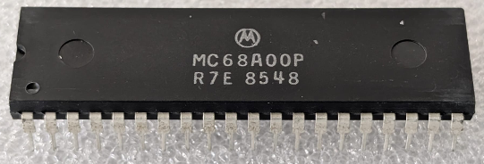

:orphan:

.. _MC68A00P:

.. #Metadata {'Product':'MC68A00P','Name':'MC68A00P Microprocessor Unit','Storage': 'Storage Box 1','Drawer':1,'Row':2,'Column':3}

MC68A00P Microprocessor Unit
============================

.. rubric:: Specific Information

.. csv-table:: 
   :widths: auto

   "Date Code","8548"
   "Manufacture Date","25-NOV-1985 to 01-DEC-1985"
   "Mask","R7E"
   "Packaging","Plastic"
   "Status","Production"
   "Location",":ref:`Storage Box 1, Drawer 1, Row 2, Column 3 <Storage_Box_1_Drawer_1>`"
   "Temperature","-0-70\ :sup:`o`\ C"
   "Frequency","1.5Mhz"
   "Notes",""

.. rubric:: Collection Information

.. csv-table:: 
   :header: "Acquired"
   :widths: auto

   |present| 29-MAR-2026

.. rubric:: Links

:download:`MC6800 DataSheet <../../../../_static/Documents/Datasheets/MC6800.pdf>`