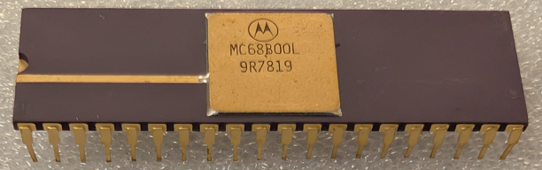

:orphan:

.. _MC68B00L:

.. #Metadata {'Product':'MC68B00L','Name':'MC68B00L Microprocessor Unit','Storage': 'Storage Box 1','Drawer':1,'Row':1,'Column':1}

MC68B00L Microprocessor Unit
============================

.. rubric:: Specific Information

.. csv-table:: 
   :widths: auto

   "Date Code","7819"
   "Manufacture Date","01-MAY-1978 to 07-MAY-1978"
   "Mask",""
   "Packaging","Ceramic"
   "Status","Production"
   "Location",":ref:`Storage Box 1, Drawer 1, Row 1, Column 1 <Storage_Box_1_Drawer_1>`"
   "Temperature","-0-70\ :sup:`o`\ C"
   "Frequency","2Mhz"
   "Notes",""

.. rubric:: Collection Information

.. csv-table:: 
   :header: "Acquired"
   :widths: auto

   |present| 08-MAY-2025

.. rubric:: Links

:download:`MC6800 DataSheet <../../../../_static/Documents/Datasheets/MC6800.pdf>`