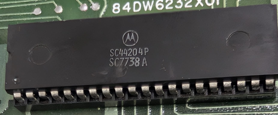

:orphan:

.. _SC44204P:

.. #Metadata {'Product':'SC44204P','Name':'SC44204P Microprocessor Unit','Storage': 'MEK6800D2'}

SC44204P Microprocessor Unit
============================

.. rubric:: Specific Information

.. csv-table:: 
   :widths: auto

   "Date Code","7738"
   "Manufacture Date","12-SEP-1977 to 18-SEP-1977"
   "Mask","SC7"
   "Packaging","Plastic"
   "Status","Engineering"
   "Location",":ref:`MEK6800D2 <Components_attached_to_the_MEK6800D2_board_Components_attached_to_the_MEK6800D2_board>`"
   "Temperature",""
   "Frequency",""
   "Notes",""

.. rubric:: Collection Information

.. csv-table:: 
   :header: "Acquired"
   :widths: auto

   |present| 09-SEP-2025

.. rubric:: Links

:download:`MC6800 DataSheet <../../../../_static/Documents/Datasheets/MC6800.pdf>`