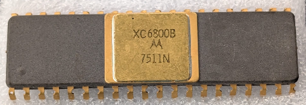

:orphan:

.. _XC6800B:

.. #Metadata {'Product':'XC6800B','Name':'XC6800B Microprocessor Unit','Storage': 'S','Drawer':0,'Row':0,'Column':0}

XC6800B Microprocessor Unit
===========================

.. rubric:: Specific Information

.. csv-table:: 
   :widths: auto

   "Date Code","TBD"
   "Manufacture Date","TBD"
   "Mask",""
   "Packaging","Ceramic"
   "Status","Engineering"
   "Location","TBD"
   "Temperature",""
   "Frequency",""
   "Notes",""

.. rubric:: Collection Information

.. csv-table:: 
   :header: "Acquired"
   :widths: auto

   |intransit|

.. rubric:: Links

:download:`MC6800 DataSheet <../../../../_static/Documents/Datasheets/MC6800.pdf>`