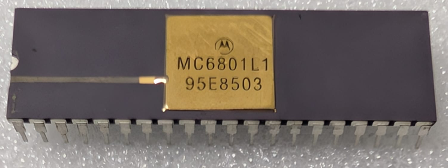

:orphan:

.. _MC6801L1:

.. #Metadata {'Product':'MC6801L1','Name':'MC6801L1 Microcomputer/Microprocessor (MCU/MPU) (MC6801)','Storage': 'Storage Box 2','Drawer':1,'Row':1,'Column':2}

MC6801L1 Microcomputer/Microprocessor (MCU/MPU) (MC6801)
========================================================

.. rubric:: Specific Information

.. csv-table:: 
   :widths: auto

   "Date Code","8503"
   "Manufacture Date","14-JAN-1985 to 20-JAN-1985"
   "Mask",""
   "Packaging","Ceramic"
   "Status","Production"
   "Location",":ref:`Storage Box 2, Drawer 1, Row 1, Column 2 <Storage_Box_2_Drawer_1>`"
   "Temperature","0-70\ :sup:`o`\ C"
   "Frequency","1 Mhz"
   "Notes",""

.. rubric:: Collection Information

.. csv-table:: 
   :header: "Acquired"
   :widths: auto

   |present| 23-SEP-2025

.. rubric:: Links

:download:`MC6801 Microcomputer/Microprocessor (MCU/MPU) (MC6801)  <../../../../_static/Documents/Datasheets/MC6801-03-03NR.pdf>`