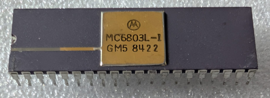

:orphan:

.. _MC6803L-1:

.. #Metadata {'Product':'MC6803L-1','Name':'MC6803L-1 Microcomputer/Microprocessor +128 bytes of RAM (MCU/MPU) (MC6803)','Storage': 'Storage Box 2','Drawer':1,'Row':3,'Column':3}

MC6803L-1 Microcomputer/Microprocessor +128 bytes of RAM (MCU/MPU) (MC6803)
===========================================================================

.. rubric:: Specific Information

.. csv-table:: 
   :widths: auto

   "Date Code","8422"
   "Manufacture Date","21-MAY-1984 to 27-MAY-1984"
   "Mask","GM5"
   "Packaging","Plastic"
   "Status","Production"
   "Location",":ref:`Storage Box 2, Drawer 1, Row 3, Column 3 <Storage_Box_2_Drawer_1>`"
   "Temperature","0-70\ :sup:`o`\ C"
   "Frequency","1 Mhz"
   "Notes",""

.. rubric:: Collection Information

.. csv-table:: 
   :header: "Acquired"
   :widths: auto

   |present| 17-AUG-2026

.. rubric:: Links

:download:`MC6803 Microcomputer/Microprocessor (MCU/MPU) (MC6803)  <../../../../_static/Documents/Datasheets/MC6801-03-03NR.pdf>`