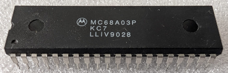

:orphan:

.. _MC68A03P:

.. #Metadata {'Product':'MC68A03P','Name':'MC68A03P Microcomputer/Microprocessor +128 bytes of RAM (MCU/MPU) (MC680P)','Storage': 'Storage Box 2','Drawer':1,'Row':2,'Column':3}

MC68A03P Microcomputer/Microprocessor +128 bytes of RAM (MCU/MPU) (MC680P)
==========================================================================

.. rubric:: Specific Information

.. csv-table:: 
   :widths: auto

   "Date Code","9028"
   "Manufacture Date","02-JUL-1990 to 08-JUL-1990"
   "Mask","KC7"
   "Packaging","Plastic"
   "Status","TBD"
   "Location",":ref:`Storage Box 2, Drawer 1, Row 2, Column 3 <Storage_Box_2_Drawer_1>`"
   "Temperature","0-70\ :sup:`o`\ C"
   "Frequency","1.5 Mhz"
   "Notes",""

.. rubric:: Collection Information

.. csv-table:: 
   :header: "Acquired"
   :widths: auto

   |present| 05-AUG-2026

.. rubric:: Links

:download:`MC6803 Microcomputer/Microprocessor (MCU/MPU) (MC6803)  <../../../../_static/Documents/Datasheets/MC6801-03-03NR.pdf>`