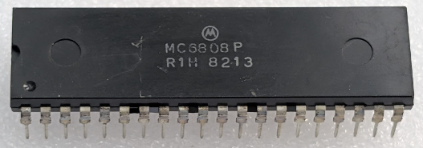

:orphan:

.. _MC6808P:

.. #Metadata {'Product':'MC6808P','Name':'MC6808P Microprocessor with Clock and Optional RAM','Storage': 'Storage Box 2','Drawer':1,'Row':3,'Column':2}

MC6808P Microprocessor with Clock and Optional RAM
==================================================

.. rubric:: Specific Information

.. csv-table:: 
   :widths: auto

   "Date Code","8213"
   "Manufacture Date","22-MAR-1982 to 28-MAR-1982"
   "Mask","R1H"
   "Packaging","Plastic"
   "Status","Production"
   "Location",":ref:`Storage Box 2, Drawer 1, Row 3, Column 2 <Storage_Box_2_Drawer_1>`"
   "Temperature","0-70\ :sup:`o`\ C"
   "Frequency","1 Mhz"
   "Notes",""

.. rubric:: Collection Information

.. csv-table:: 
   :header: "Acquired"
   :widths: auto

   |present| 29-APR-2026

.. rubric:: Links

:download:`MC6808 Microprocessor with Clock and Optional RAM (MC6808)  <../../../../_static/Documents/Datasheets/DS-MC6802-6808-6802NS.pdf>`