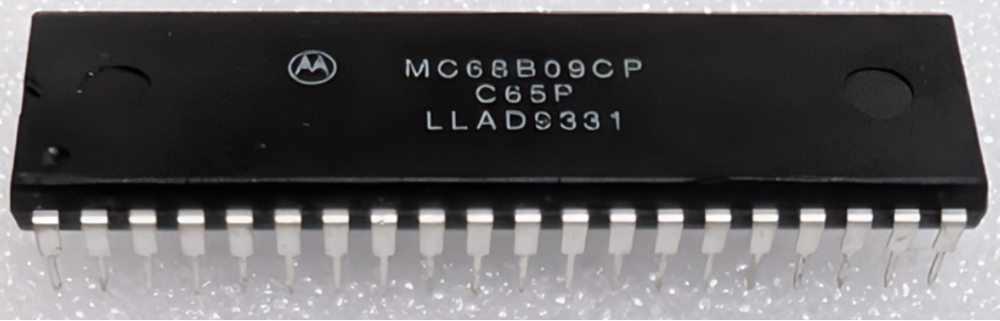

:orphan:

.. _MC68B09CP:

.. #Metadata {'Product':'MC68B09CP','Name':'MC68B09CP 8-Bit Microprocessing Unit','Storage': 'Storage Box 1','Drawer':3,'Row':1,'Column':1}

MC68B09CP 8-Bit Microprocessing Unit
====================================

.. rubric:: Specific Information

.. csv-table:: 
   :widths: auto

   "Date Code","9331"
   "Manufacture Date","26-JUL-1993 to 01-AUG-1993"
   "Mask","C65P"
   "Packaging","Plastic"
   "Status","Production"
   "Location",":ref:`Storage Box 1, Drawer 3, Row 1, Column 1 <Storage_Box_1_Drawer_3>`"
   "Temperature","-40-85\ :sup:`o`\ C"
   "Frequency","2 Mhz"
   "Notes",""

.. rubric:: Collection Information

.. csv-table:: 
   :header: "Acquired"
   :widths: auto

   |present| 05-OCT-2025

.. rubric:: Links

:download:`MC6809 8-Bit Microprocessing Unit  <../../../../_static/Documents/Datasheets/MC6809.pdf>`