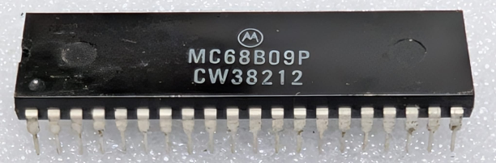

:orphan:

.. _MC68B09P:

.. #Metadata {'Product':'MC68B09P','Name':'MC68B09P 8-Bit Microprocessing Unit','Storage': 'Storage Box 2','Drawer':2,'Row':2,'Column':2}

MC68B09P 8-Bit Microprocessing Unit
===================================

.. rubric:: Specific Information

.. csv-table:: 
   :widths: auto

   "Date Code","8212"
   "Manufacture Date","15-MAR-1982 to 21-MAR-1982"
   "Mask","CW3"
   "Packaging","Plastic"
   "Status","Production"
   "Location",":ref:`Storage Box 2, Drawer 2, Row 2, Column 2 <Storage_Box_2_Drawer_2>`"
   "Temperature","0-70\ :sup:`o`\ C"
   "Frequency","2 Mhz"
   "Notes",""

.. rubric:: Collection Information

.. csv-table:: 
   :header: "Acquired"
   :widths: auto

   |present| 27-OCT-2025

.. rubric:: Links

:download:`MC6809 8-Bit Microprocessing Unit  <../../../../_static/Documents/Datasheets/MC6809.pdf>`