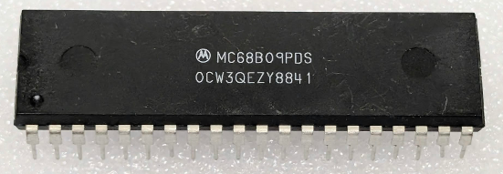

:orphan:

.. _MC68B09PDS:

.. #Metadata {'Product':'MC68B09PDS','Name':'MC68B09PDS 8-Bit Microprocessing Unit','Storage': 'Storage Box 1','Drawer':3,'Row':2,'Column':2}

MC68B09PDS 8-Bit Microprocessing Unit
=====================================

.. rubric:: Specific Information

.. csv-table:: 
   :widths: auto

   "Date Code","8841"
   "Manufacture Date","03-OCT-1988 to 09-OCT-1988"
   "Mask","OCW3QEZY"
   "Packaging","Plastic"
   "Status","TBD"
   "Location",":ref:`Storage Box 1, Drawer 3, Row 2, Column 2 <Storage_Box_1_Drawer_3>`"
   "Temperature","0-70\ :sup:`o`\ C"
   "Frequency","2 Mhz"
   "Notes",""

.. rubric:: Collection Information

.. csv-table:: 
   :header: "Acquired"
   :widths: auto

   |present| 05-AUG-2026

.. rubric:: Links

:download:`MC6809 8-Bit Microprocessing Unit  <../../../../_static/Documents/Datasheets/MC6809.pdf>`