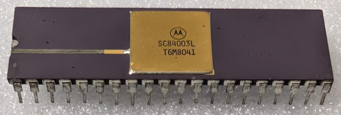

:orphan:

.. _SC84003L:

.. #Metadata {'Product':'SC84003L','Name':'SC84003L (MC6809) 8-Bit Microprocessing Unit','Storage': 'Storage Box 1','Drawer':3,'Row':1,'Column':3}

SC84003L (MC6809) 8-Bit Microprocessing Unit
============================================

.. rubric:: Specific Information

.. csv-table:: 
   :widths: auto

   "Date Code","8041"
   "Manufacture Date","06-OCT-1980 to 12-OCT-1980"
   "Mask",""
   "Packaging","Ceramic"
   "Status","Engineering Sample"
   "Location",":ref:`Storage Box 1, Drawer 3, Row 1, Column 3 <Storage_Box_1_Drawer_3>`"
   "Temperature","TBD"
   "Frequency","TBD"
   "Notes",""

.. rubric:: Collection Information

.. csv-table:: 
   :header: "Acquired"
   :widths: auto

   |present| 06-AUG-2025

