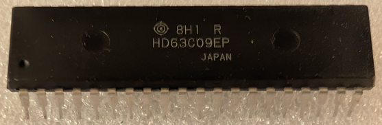

:orphan:

.. _HD63C09EP:

.. #Metadata {'Product':'HD63C09EP','Name':'HD63C09EP 8-Bit Microprocessing Unit Hitachi (Enhanced)','Storage': 'Storage Box 1','Drawer':3,'Row':1,'Column':2}

HD63C09EP 8-Bit Microprocessing Unit Hitachi (Enhanced)
=======================================================

.. note:: 

   This is a Hitachi HD63C09EP, which is an enhanced version of the MC6809E. It has 3.0 or 3.5 MHz clock speed and is compatible with the MC6809E.
   It is a CMOS version of the MC6809E, which allows for lower power consumption and higher performance and is pin-compatible with the MC6809E, making it a drop-in replacement for applications that require the enhanced features of the HD63C09EP.

   The HD63C09EP supports a wider range of operating voltages, making it suitable for battery-powered applications.

   It is often used in embedded systems, industrial control, and consumer electronics due to its enhanced features and performance.

   Note that Motorola did not produce a 3MHz version of the MC6809E.

.. rubric:: Specific Information

.. csv-table:: 
   :widths: auto

   "Date Code","N/A"
   "Manufacture Date","1982+"
   "Mask",""
   "Packaging","Plastic"
   "Status","Production"
   "Location",":ref:`Storage Box 1, Drawer 3, Row 1, Column 2 <Storage_Box_1_Drawer_3>`"
   "Temperature","0-70\ :sup:`o`\ C"
   "Frequency","3/3.5 Mhz"
   "Notes",""

.. rubric:: Collection Information

.. csv-table:: 
   :header: "Acquired"
   :widths: auto

   |present| 05-JUL-2025

.. rubric:: Links

:download:`Hitachi HD63x09E Datasheet  <../../../../_static/Documents/Datasheets/Hitachi-HD63x09E.pdf>`