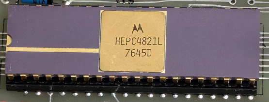

:orphan:

.. _HEPC4821L:

.. #Metadata {'Product':'HEPC4821L','Name':'HEPC4821L HEP version of MC6820','Storage': 'EDUCATORII'}

HEPC4821L HEP version of MC6820
===============================

.. rubric:: Specific Information

.. csv-table:: 
   :widths: auto

   "Date Code","7645D"
   "Manufacture Date","01-NOV-1976 to 07-NOV-1976"
   "Mask","N/A"
   "Packaging","Ceramic"
   "Status","HEP"
   "Location",":ref:`EDUCATORII <Educator_II_Microcomputer_Kit_Educator_II_Microcomputer_Kit>`"
   "Temperature",""
   "Frequency",""
   "Notes",""

.. rubric:: Collection Information

.. csv-table:: 
   :header: "Acquired"
   :widths: auto

   |present| 14-JAN-2026

