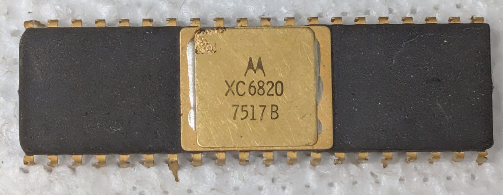

:orphan:

.. _XC6820:

.. #Metadata {'Product':'XC6820','Name':'XC6820 Peripheral Interface Adapter','Storage': 'Briefcase'}

XC6820 Peripheral Interface Adapter
===================================

.. rubric:: Specific Information

.. csv-table:: 
   :widths: auto

   "Date Code","7517"
   "Manufacture Date","21-APR-1975 to 27-APR-1975"
   "Mask",""
   "Packaging","Ceramic"
   "Status","Engineering"
   "Location",":ref:`Briefcase <Briefcase_MES6800_Briefcase_MES6800>`"
   "Temperature",""
   "Frequency",""
   "Notes",""

.. rubric:: Collection Information

.. csv-table:: 
   :header: "Acquired"
   :widths: auto

   |present| 30-JAN-2025

