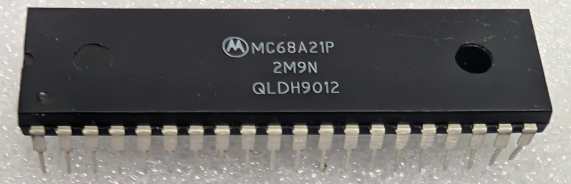

:orphan:

.. _MC68A21P:

.. #Metadata {'Product':'MC68A21P','Name':'MC68A21P Peripheral Interface Adapter (PIA)','Storage': 'Storage Box 2','Drawer':3,'Row':3,'Column':2}

MC68A21P Peripheral Interface Adapter (PIA)
===========================================

.. rubric:: Specific Information

.. csv-table:: 
   :widths: auto

   "Date Code","9012"
   "Manufacture Date","12-MAR-1990 to 18-MAR-1990"
   "Mask","2M9N"
   "Packaging","Plastic"
   "Status","Production"
   "Location",":ref:`Storage Box 2, Drawer 3, Row 3, Column 2 <Storage_Box_2_Drawer_3>`"
   "Temperature","0-70\ :sup:`o`\ C"
   "Frequency","1.5 Mhz"
   "Notes",""

.. rubric:: Collection Information

.. csv-table:: 
   :header: "Acquired"
   :widths: auto

   |present| 31-JUL-2026

.. rubric:: Links

:download:`MC6821 Peripheral Interface Adapter (PIA)  <../../../../_static/Documents/Datasheets/MC6821.pdf>`