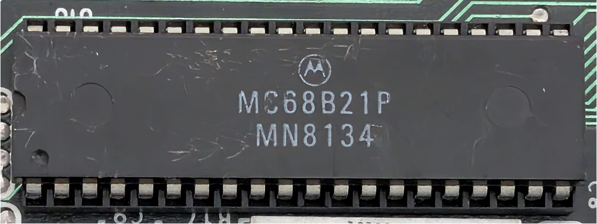

:orphan:

.. _MC68B21P:

.. #Metadata {'Product':'MC68B21P','Name':'MC68B21P Peripheral Interface Adapter (PIA)','Storage': 'M68MM16'}

MC68B21P Peripheral Interface Adapter (PIA)
===========================================

.. rubric:: Specific Information

.. csv-table:: 
   :widths: auto

   "Date Code","8134"
   "Manufacture Date","17-AUG-1981 to 23-AUG-1981"
   "Mask","MN"
   "Packaging","Plastic"
   "Status","Production"
   "Location",":ref:`M68MM16 Micromodule <Components_attached_to_the_M68MM16_Micromodule_Components_attached_to_the_M68MM16_Micromodule>`"
   "Temperature","0-70\ :sup:`o`\ C"
   "Frequency","2 Mhz"
   "Notes",""

.. rubric:: Collection Information

.. csv-table:: 
   :header: "Acquired"
   :widths: auto

   |present| 17-NOV-2025

.. rubric:: Links

:download:`MC6821 MC6821 Peripheral Interface Adapter (PIA)  <../../../../_static/Documents/Datasheets/MC6821.pdf>`