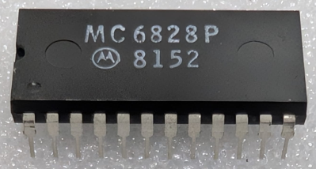

:orphan:

.. _MC6828P:

.. #Metadata {'Product':'MC6828P','Name':'MC6828P Priority Interrupt Controller','Storage': 'Storage Box 2','Drawer':4,'Row':1,'Column':2}

MC6828P Priority Interrupt Controller
=====================================

.. rubric:: Specific Information

.. csv-table:: 
   :widths: auto

   "Date Code","8152"
   "Manufacture Date","21-DEC-1981 to 27-DEC-1981"
   "Mask",""
   "Packaging","Plastic"
   "Status","TBD"
   "Location",":ref:`Storage Box 2, Drawer 4, Row 1, Column 2 <Storage_Box_2_Drawer_4>`"
   "Temperature","N/A"
   "Frequency","N/A"
   "Notes",""

.. rubric:: Collection Information

.. csv-table:: 
   :header: "Acquired"
   :widths: auto

   |present| 27-OCT-2025

.. rubric:: Links

:download:`MC6828 DataSheet <../../../../_static/Documents/Datasheets/MC6828.pdf>`