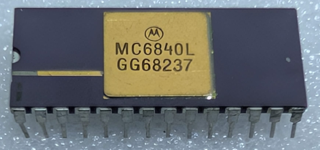

:orphan:

.. _MC6840L:

.. #Metadata {'Product':'MC6840L','Name':'MC6840L Programmable Timer Module (PTM)','Storage': 'Storage Box 1','Drawer':4,'Row':3,'Column':6}

MC6840L Programmable Timer Module (PTM)
=======================================

.. rubric:: Specific Information

.. csv-table:: 
   :widths: auto

   "Date Code","8237"
   "Manufacture Date","06-SEP-1982 to 12-SEP-1982"
   "Mask","GG6"
   "Packaging","Ceramic"
   "Status","Production"
   "Location",":ref:`Storage Box 1, Drawer 4, Row 3, Column 6 <Storage_Box_1_Drawer_2>`"
   "Temperature","0-70\ :sup:`o`\ C"
   "Frequency","2 Mhz"
   "Notes",""

.. rubric:: Collection Information

.. csv-table:: 
   :header: "Acquired"
   :widths: auto

   |present| 08-JAN-2026

.. rubric:: Links

:download:`MC6840 Programmable Timer Module (PTM)  <../../../../_static/Documents/Datasheets/MC6840.pdf>`