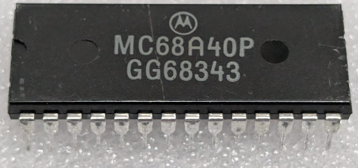

:orphan:

.. _MC68A40P:

.. #Metadata {'Product':'MC68A40P','Name':'MC68A40P Programmable Timer Module (PTM)','Storage': 'Storage Box 2','Drawer':3,'Row':1,'Column':3}

MC68A40P Programmable Timer Module (PTM)
========================================

.. rubric:: Specific Information

.. csv-table:: 
   :widths: auto

   "Date Code","8343"
   "Manufacture Date","17-OCT-1983 to 23-OCT-1983"
   "Mask","GG6"
   "Packaging","Plastic"
   "Status","Productiom"
   "Location",":ref:`Storage Box 2, Drawer 3, Row 1, Column 3 <Storage_Box_2_Drawer_3>`"
   "Temperature","0-70\ :sup:`o`\ C"
   "Frequency","1.5 Mhz"
   "Notes",""

.. rubric:: Collection Information

.. csv-table:: 
   :header: "Acquired"
   :widths: auto

   |present| 14-APR-2026

.. rubric:: Links

:download:`MC6840 Programmable Timer Module (PTM)  <../../../../_static/Documents/Datasheets/MC6840.pdf>`