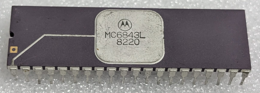

:orphan:

.. _MC6843L:

.. #Metadata {'Product':'MC6843L','Name':'MC6843L Floppy Disk Controller (FDC) (MC6843)','Storage': 'Storage Box 2','Drawer':2,'Row':1,'Column':2}

MC6843L Floppy Disk Controller (FDC) (MC6843)
=============================================

.. rubric:: Specific Information

.. csv-table:: 
   :widths: auto

   "Date Code","8220"
   "Manufacture Date","10-MAY-1982 to 16-MAY-1982"
   "Mask",""
   "Packaging","Ceramic"
   "Status","Production"
   "Location",":ref:`Storage Box 2, Drawer 2, Row 1, Column 2 <Storage_Box_2_Drawer_2>`"
   "Temperature","0-70\ :sup:`o`\ C"
   "Frequency","1 Mhz"
   "Notes",""

.. rubric:: Collection Information

.. csv-table:: 
   :header: "Acquired"
   :widths: auto

   |present| 02-DEC-2025

