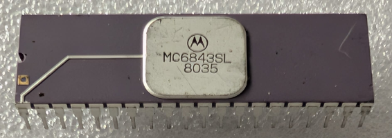

:orphan:

.. _MC6843SL:

.. #Metadata {'Product':'MC6843SL','Name':'MC6843SL Floppy Disk Controller (FDC) (MC6843)','Storage': 'Storage Box 2','Drawer':2,'Row':3,'Column':2}

MC6843SL Floppy Disk Controller (FDC) (MC6843)
==============================================

.. rubric:: Specific Information

.. csv-table:: 
   :widths: auto

   "Date Code","8035"
   "Manufacture Date","25-AUG-1980 to 31-AUG-1980"
   "Mask",""
   "Packaging","Ceramic"
   "Status","Production"
   "Location",":ref:`Storage Box 2, Drawer 2, Row 3, Column 2 <Storage_Box_2_Drawer_2>`"
   "Temperature","0-70\ :sup:`o`\ C"
   "Frequency","1 Mhz"
   "Notes",""

.. rubric:: Collection Information

.. csv-table:: 
   :header: "Acquired"
   :widths: auto

   |present| 31-JUL-2026

