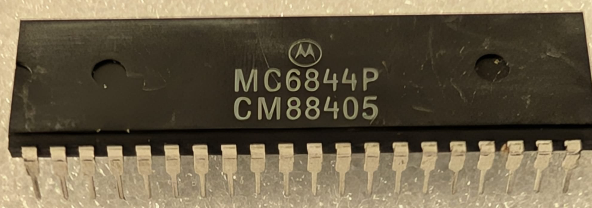

:orphan:

.. _MC6844P:

.. #Metadata {'Product':'MC6844P','Name':'MC6844P Direct Memory Access Controller (DMAC)','Storage': 'Storage Box 3','Drawer':1,'Row':3,'Column':2}

MC6844P Direct Memory Access Controller (DMAC)
==============================================

.. rubric:: Specific Information

.. csv-table:: 
   :widths: auto

   "Date Code","8840"
   "Manufacture Date","26-SEP-1988 to 02-OCT-1988"
   "Mask",""
   "Packaging","Plastic"
   "Status","Production"
   "Location",":ref:`Storage Box 3, Drawer 1, Row 3, Column 2 <Storage_Box_3_Drawer_1>`"
   "Temperature","TBD"
   "Frequency","TBD"
   "Notes",""

.. rubric:: Collection Information

.. csv-table:: 
   :header: "Acquired"
   :widths: auto

   |present| 07-JUL-2025

