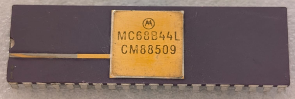

:orphan:

.. _MC68B44L:

.. #Metadata {'Product':'MC68B44L','Name':'MC68B44L Direct Memory Access Controller (DMAC)','Storage': 'Storage Box 1','Drawer':2,'Row':1,'Column':2}

MC68B44L Direct Memory Access Controller (DMAC)
===============================================

.. rubric:: Specific Information

.. csv-table:: 
   :widths: auto

   "Date Code","8509"
   "Manufacture Date","25-FEB-1985 to 03-MAR-1985"
   "Mask",""
   "Packaging","Ceramic"
   "Status","Production"
   "Location",":ref:`Storage Box 1, Drawer 2, Row 1, Column 2 <Storage_Box_1_Drawer_2>`"
   "Temperature","0-70\ :sup:`o`\ C"
   "Frequency","2 MHz"
   "Notes",""

.. rubric:: Collection Information

.. csv-table:: 
   :header: "Acquired"
   :widths: auto

   |present| 08-MAY-2025

.. rubric:: Links

:download:`MC6844 Direct Memory Access Controller (DMAC)  <../../../../_static/Documents/Datasheets/MC6844.pdf>`