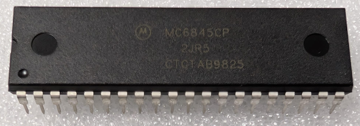

:orphan:

.. _MC6845CP:

.. #Metadata {'Product':'MC6845CP','Name':'MC6845CP CRT Controller','Storage': 'Storage Box 2','Drawer':3,'Row':2,'Column':1}

MC6845CP CRT Controller
=======================

.. rubric:: Specific Information

.. csv-table:: 
   :widths: auto

   "Date Code","9825"
   "Manufacture Date","15-JUN-1998 to 21-JUN-1998"
   "Mask",""
   "Packaging","Plastic"
   "Status","Production"
   "Location",":ref:`Storage Box 2, Drawer 3, Row 2, Column 1 <Storage_Box_2_Drawer_3>`"
   "Temperature","N/A"
   "Frequency","N/A"
   "Notes",""

.. rubric:: Collection Information

.. csv-table:: 
   :header: "Acquired"
   :widths: auto

   |present| 23-SEP-2025

.. rubric:: Links

:download:`MC6845 CRT Controller  <../../../../_static/Documents/Datasheets/MC6845.pdf>`