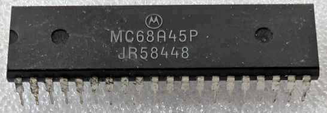

:orphan:

.. _MC68A45P:

.. #Metadata {'Product':'MC68A45P','Name':'MC68A45P CRT Controller (CRTC)','Storage': 'Storage Box 2','Drawer':2,'Row':3,'Column':1}

MC68A45P CRT Controller (CRTC)
==============================

.. rubric:: Specific Information

.. csv-table:: 
   :widths: auto

   "Date Code","TBD"
   "Manufacture Date","TBD"
   "Mask",""
   "Packaging","Plastic"
   "Status","TBD"
   "Location",":ref:`Storage Box 2, Drawer 2, Row 3, Column 1 <Storage_Box_2_Drawer_2>`"
   "Temperature","0-70\ :sup:`o`\ C"
   "Frequency","1.5 Mhz"
   "Notes",""

.. rubric:: Collection Information

.. csv-table:: 
   :header: "Acquired"
   :widths: auto

   |present| 13-MAR-2026

.. rubric:: Links

:download:`MC6845 CRT Controller (CRTC)  <../../../../_static/Documents/Datasheets/MC6845.pdf>`