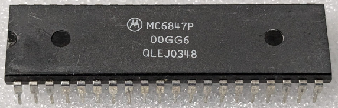

:orphan:

.. _MC6847P:

.. #Metadata {'Product':'MC6847P','Name':'MC6847P Non-Interlaced Video Display Generator Unit','Storage': 'Storage Box 2','Drawer':2,'Row':1,'Column':1}

MC6847P Non-Interlaced Video Display Generator Unit
===================================================

.. rubric:: Specific Information

.. csv-table:: 
   :widths: auto

   "Date Code","Undertermined"
   "Manufacture Date","Undertermined"
   "Mask",""
   "Packaging","Plastic"
   "Status","Production"
   "Location",":ref:`Storage Box 2, Drawer 2, Row 1, Column 1 <Storage_Box_2_Drawer_2>`"
   "Temperature",""
   "Frequency",""
   "Notes",""

.. rubric:: Collection Information

.. csv-table:: 
   :header: "Acquired"
   :widths: auto

   |present| 28-MAY-2025

.. rubric:: Links

:download:`MC6847 DataSheet <../../../../_static/Documents/Datasheets/MC6847.pdf>`