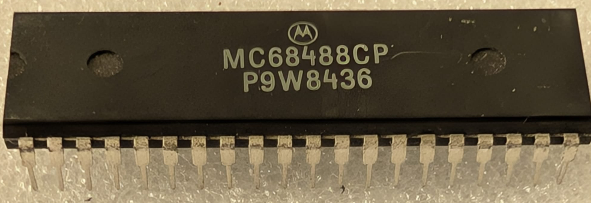

:orphan:

.. _MC68488CP:

.. #Metadata {'Product':'MC68488CP','Name':'MC68488CP General Purpose Interface Adapter','Storage': 'Storage Box 1','Drawer':2,'Row':2,'Column':3}

MC68488CP General Purpose Interface Adapter
===========================================

.. rubric:: Specific Information

.. csv-table:: 
   :widths: auto

   "Date Code","8436"
   "Manufacture Date","27-AUG-1984 to 02-SEP-1984"
   "Mask",""
   "Packaging","Plastic"
   "Status","Production"
   "Location",":ref:`Storage Box 1, Drawer 2, Row 2, Column 3 <Storage_Box_1_Drawer_2>`"
   "Temperature","-40-85\ :sup:`o`\ C"
   "Frequency","1 Mhz"
   "Notes",""

.. rubric:: Collection Information

.. csv-table:: 
   :header: "Acquired"
   :widths: auto

   |present| 07-JUL-2025

.. rubric:: Links

:download:`MC68488 General Purpose Interface Adapter  <../../../../_static/Documents/Datasheets/MC68488.pdf>`