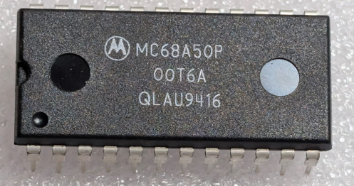

:orphan:

.. _MC68A50P:

.. #Metadata {'Product':'MC68A50P','Name':'MC68A50P Asynchronous Communications Interface Adapter (MC6850)','Storage': 'Storage Box 1','Drawer':4,'Row':3,'Column':6}

MC68A50P Asynchronous Communications Interface Adapter (MC6850)
===============================================================

.. rubric:: Specific Information

.. csv-table:: 
   :widths: auto

   "Date Code","9416"
   "Manufacture Date","11-APR-1994 to 17-APR-1994"
   "Mask",""
   "Packaging","Plastic"
   "Status","Production"
   "Location",":ref:`Storage Box 1, Drawer 4, Row 3, Column 6 <Storage_Box_1_Drawer_4>`"
   "Temperature","0-70\ :sup:`o`\ C"
   "Frequency","1.5MHz"
   "Notes",""

.. rubric:: Collection Information

.. csv-table:: 
   :header: "Acquired"
   :widths: auto

   |present| 30-MAY-2025

