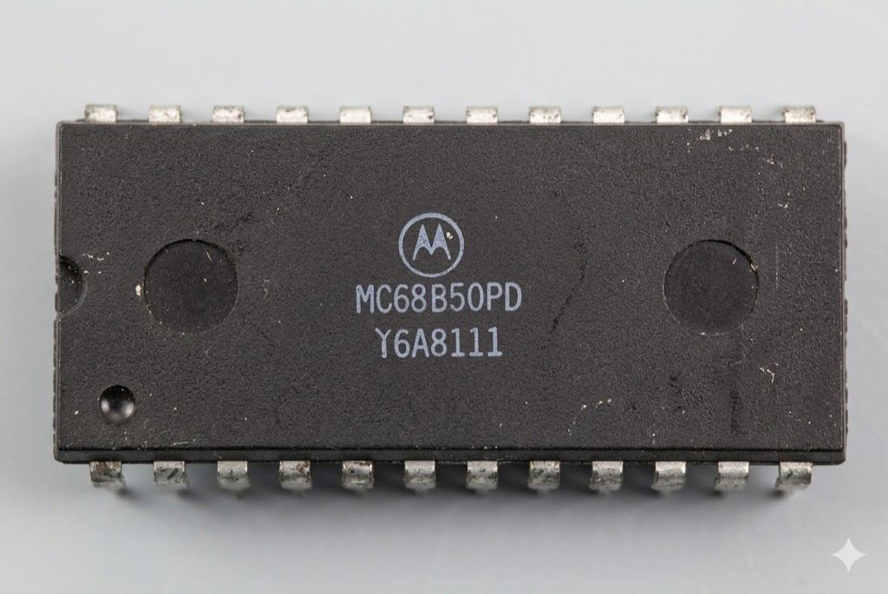

:orphan:

.. _MC68B50PD:

.. #Metadata {'Product':'MC68B50PD','Name':'MC68B50PD Asynchronous Communications Interface Adapter (MC6850)','Storage': 'S','Drawer':0,'Row':0,'Column':0}

MC68B50PD Asynchronous Communications Interface Adapter (MC6850)
================================================================

.. rubric:: Specific Information

.. csv-table:: 
   :widths: auto

   "Date Code","TBD"
   "Manufacture Date","TBD"
   "Mask",""
   "Packaging","Ceramic"
   "Status","TBD"
   "Location","TBD"
   "Temperature","0-70\ :sup:`o`\ C"
   "Frequency","2MHz"
   "Notes",""

.. rubric:: Collection Information

.. csv-table:: 
   :header: "intransit"
   :widths: auto

   |notpresent|

