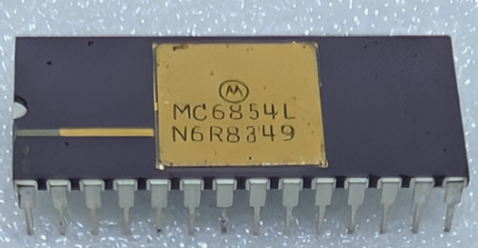

:orphan:

.. _MC6854L:

.. #Metadata {'Product':'MC6854L','Name':'MC6854L Advanced Data-Link Controller (ADLC)','Storage': 'Storage Box 3','Drawer':2,'Row':1,'Column':3}

MC6854L Advanced Data-Link Controller (ADLC)
============================================

.. rubric:: Specific Information

.. csv-table:: 
   :widths: auto

   "Date Code","8349"
   "Manufacture Date","28-NOV-1983 to 04-DEC-1983"
   "Mask","N6R"
   "Packaging","Ceramic"
   "Status","Production"
   "Location",":ref:`Storage Box 3, Drawer 2, Row 1, Column 3 <Storage_Box_3_Drawer_2>`"
   "Temperature","0-70\ :sup:`o`\ C"
   "Frequency","1 Mhz"
   "Notes",""

.. rubric:: Collection Information

.. csv-table:: 
   :header: "Acquired"
   :widths: auto

   |present| 28-OCT-2025

.. rubric:: Links

:download:`MC6854 Advanced Data-Link Controller (ADLC)  <../../../../_static/Documents/Datasheets/MC6854.pdf>`