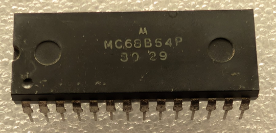

:orphan:

.. _MC68B54P:

.. #Metadata {'Product':'MC68B54P','Name':'MC68B54P Advanced Data Link Controller (ADLC)','Storage': 'Storage Box 3','Drawer':2,'Row':1,'Column':2}

MC68B54P Advanced Data Link Controller (ADLC)
=============================================

.. rubric:: Specific Information

.. csv-table:: 
   :widths: auto

   "Date Code","8029"
   "Manufacture Date","14-JUL-1980 to 20-JUL-1980"
   "Mask",""
   "Packaging","Plastic"
   "Status","Production"
   "Location",":ref:`Storage Box 3, Drawer 2, Row 1, Column 2 <Storage_Box_3_Drawer_2>`"
   "Temperature",""
   "Frequency",""
   "Notes",""

.. rubric:: Collection Information

.. csv-table:: 
   :header: "Acquired"
   :widths: auto

   |present| 12-MAR-2025

.. rubric:: Links

:download:`MC6854 Advanced Data-Link Controller (ADLC)  <../../../../_static/Documents/Datasheets/MC6854.pdf>`