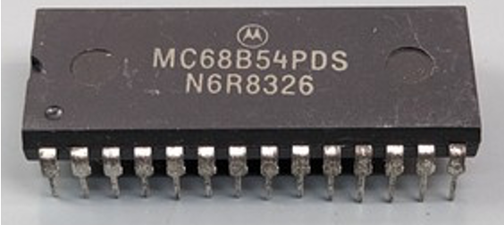

:orphan:

.. _MC68B54PDS:

.. #Metadata {'Product':'MC68B54PDS','Name':'MC68B54PDS Advanced Data-Link Controller (ADLC)','Storage': 'S','Drawer':0,'Row':0,'Column':0}

MC68B54PDS Advanced Data-Link Controller (ADLC)
===============================================

.. rubric:: Specific Information

.. csv-table:: 
   :widths: auto

   "Date Code","TBD"
   "Manufacture Date","TBD"
   "Mask",""
   "Packaging","CERDIP"
   "Status","TBD"
   "Location","TBD"
   "Temperature","-40-85\ :sup:`o`\ C"
   "Frequency","2 Mhz"
   "Notes",""

.. rubric:: Collection Information

.. csv-table:: 
   :header: "Acquired"
   :widths: auto

   |intransit|

.. rubric:: Links

:download:`MC6854 Advanced Data-Link Controller (ADLC)  <../../../../_static/Documents/Datasheets/MC6854.pdf>`