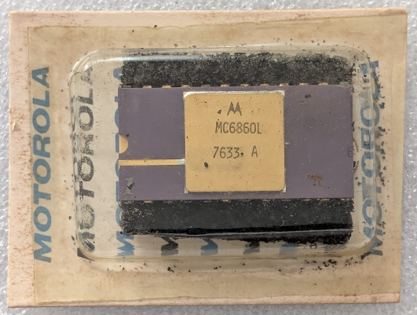

:orphan:

.. _MC6860L:

.. #Metadata {'Product':'MC6860L','Name':'MC6860L 0-600 bps Digital Modem','Storage': 'Storage Box 2','Drawer':0,'Row':1,'Column':2}

MC6860L 0-600 bps Digital Modem
===============================

.. rubric:: Specific Information

.. csv-table:: 
   :widths: auto

   "Date Code","7633"
   "Manufacture Date","09-AUG-1976 to 15-AUG-1976"
   "Mask",""
   "Packaging","Ceramic"
   "Status","Production"
   "Location",":ref:`Storage Box 2, Drawer 0, Row 1, Column 2 <Storage_Box_2_Drawer_0>`"
   "Temperature",""
   "Frequency",""
   "Notes",""

.. rubric:: Collection Information

.. csv-table:: 
   :header: "Acquired"
   :widths: auto

   |present| 02-JUN-2025

.. rubric:: Links

:download:`MC6860 Datasheet <../../../../_static/Documents/Datasheets/MC6860.pdf>`

:download:`MC6860L Advance Information Datasheet <../../../../_static/Documents/Datasheets/MC6860L.1.pdf>`
