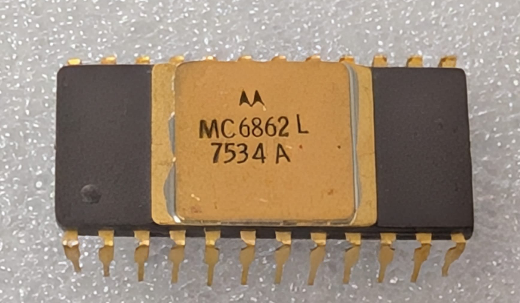

:orphan:

.. _MC6862L:

.. #Metadata {'Product':'MC6862L','Name':'MC6862L 2400 bps Digital Modulator','Storage': 'Storage Box 1','Drawer':4,'Row':1,'Column':2}

MC6862L 2400 bps Digital Modulator
==================================

.. rubric:: Specific Information

.. csv-table:: 
   :widths: auto

   "Date Code","7534"
   "Manufacture Date","18-AUG-1975 to 24-AUG-1975"
   "Mask",""
   "Packaging","Ceramic"
   "Status","Production"
   "Location",":ref:`Storage Box 1, Drawer 4, Row 1, Column 2 <Storage_Box_1_Drawer_4>`"
   "Temperature",""
   "Frequency",""
   "Notes",""

.. rubric:: Collection Information

.. csv-table:: 
   :header: "Acquired"
   :widths: auto

   |present| 25-APR-2025

.. rubric:: Links

:download:`MC6862 2400 bps Digital Modulator  <../../../../_static/Documents/Datasheets/MC6862.pdf>`