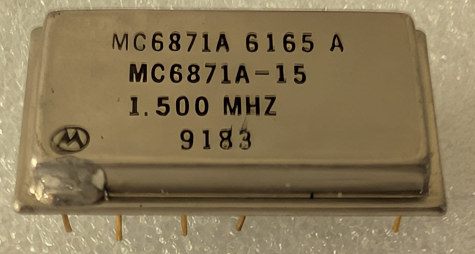

:orphan:

.. _MC6871A15:

.. #Metadata {'Product':'MC6871A15','Name':'MC6871A-15 Two-Phase Microprocessor Clock','Storage': 'Storage Box 1','Drawer':3,'Row':3,'Column':2}

MC6871A-15 Two-Phase Microprocessor Clock
=========================================

.. rubric:: Specific Information

.. csv-table:: 
   :widths: auto

   "Date Code","N/A"
   "Manufacture Date","N/A"
   "Mask",""
   "Packaging","Hermetically sealed ceramic DIP"
   "Status","Production"
   "Location",":ref:`Storage Box 1, Drawer 3, Row 3, Column 2 <Storage_Box_1_Drawer_3>`"
   "Temperature","0-120\ :sup:`o`\ C"
   "Frequency","1.5Mhz"
   "Notes",""

.. rubric:: Collection Information

.. csv-table:: 
   :header: "Acquired"
   :widths: auto

   |present| 07-JUL-2025

.. rubric:: Links

:download:`Two-Phase Microprocessor Clock (MC6871)  <../../../../_static/Documents/Datasheets/MC6870-MC6871.pdf>`