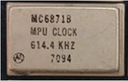

:orphan:

.. _MC6871B:

.. #Metadata {'Product':'MC6871B','Name':'MC6871B MPU Clock 614.4 KHz','Storage': 'S','Drawer':0,'Row':0,'Column':0}

MC6871B MPU Clock 614.4 KHz
===========================

.. rubric:: Specific Information

.. csv-table:: 
   :widths: auto

   "Date Code","TBD"
   "Manufacture Date","TBD"
   "Mask",""
   "Packaging","Hermetically sealed ceramic DIP"
   "Status","TBD"
   "Location","TBD"
   "Temperature","0-70\ :sup:`o`\ C"
   "Frequency","614.4 KHz"
   "Notes",""

.. rubric:: Collection Information

.. csv-table:: 
   :header: "Acquired"
   :widths: auto

   |notpresent|