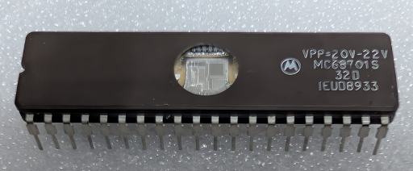

:orphan:

.. _MC68701S:

.. #Metadata {'Product':'MC68701S','Name':'MC68701S Microprocessor Unit','Storage': 'Storage Box 2','Drawer':2,'Row':3,'Column':1}

MC68701S Microprocessor Unit
============================

.. rubric:: Specific Information

.. csv-table:: 
   :widths: auto

   "Date Code","8933"
   "Manufacture Date","07-AUG-1989 to 13-AUG-1989"
   "Mask","32D"
   "Packaging","Ceramic"
   "Status","Production"
   "Location",":ref:`Storage Box 2, Drawer 2, Row 3, Column 1 <Storage_Box_2_Drawer_2>`"
   "Temperature","TBD"
   "Frequency","TBD"
   "Notes",""

.. rubric:: Collection Information

.. csv-table:: 
   :header: "Acquired"
   :widths: auto

   |present| 28-OCT-2025

.. rubric:: Links

:download:`MC68701 Microcomputer Unit <../../../../_static/Documents/Datasheets/mc68701.pdf>`