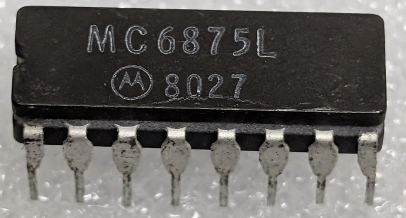

:orphan:

.. _MC6875L:

.. #Metadata {'Product':'MC6875L','Name':'MC6875L M6800 Two-Phase Clock Generator/Driver (MC6875)','Storage': 'Storage Box 2','Drawer':4,'Row':1,'Column':3}

MC6875L M6800 Two-Phase Clock Generator/Driver (MC6875)
=======================================================

.. rubric:: Specific Information

.. csv-table:: 
   :widths: auto

   "Date Code","8027"
   "Manufacture Date","30-JUN-1980 to 06-JUL-1980"
   "Mask",""
   "Packaging","Ceramic"
   "Status","TBD"
   "Location",":ref:`Storage Box 2, Drawer 4, Row 1, Column 3 <Storage_Box_2_Drawer_4>`"
   "Temperature","0-70\ :sup:`o`\ C"
   "Frequency","N/A"
   "Notes",""

.. rubric:: Collection Information

.. csv-table:: 
   :header: "Acquired"
   :widths: auto

   |present| 21-OCT-2025

.. rubric:: Links

:download:`M6800 Two-Phase Clock Generator/Driver (MC6875)  <../../../../_static/Documents/Datasheets/MC6875.pdf>`