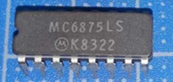

:orphan:

.. _MC6875SL:

.. #Metadata {'Product':'MC6875SL','Name':'MC6875L M6800 Two-Phase Clock Generator/Driver (MC6875)','Storage': 'S','Drawer':0,'Row':0,'Column':0}

MC6875SL M6800 Two-Phase Clock Generator/Driver (MC6875)
========================================================

.. rubric:: Specific Information

.. csv-table:: 
   :widths: auto

   "Date Code",""
   "Manufacture Date",""
   "Mask",""
   "Packaging","Ceramic"
   "Status","TBD"
   "Location","TBD"
   "Temperature","0-70\ :sup:`o`\ C"
   "Frequency","N/A"
   "Notes",""

.. rubric:: Collection Information

.. csv-table:: 
   :header: "Acquired"
   :widths: auto

   |notpresent| 

.. rubric:: Links

:download:`M6800 Two-Phase Clock Generator/Driver (MC6875)  <../../../../_static/Documents/Datasheets/MC6875.pdf>`