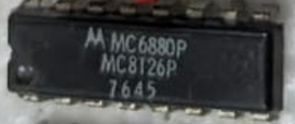

:orphan:

.. _MC6880P:

.. #Metadata {'Product':'MC6880P','Name':'MC6880AL Quad Three-State Bus Transceiver','Storage': 'Briefcase'}

MC6880 Quad Three-State Bus Transceiver
=======================================

.. rubric:: Specific Information

.. csv-table:: 
   :widths: auto

   "Date Code","7645"
   "Manufacture Date","01-NOV-1976 to 07-NOV-1976"
   "Mask",""
   "Packaging","Plastic"
   "Status","TBD"
   "Location",":ref:`Briefcase <Briefcase_MES6800_Briefcase_MES6800>`"
   "Temperature","N/A"
   "Frequency","N/A"
   "Notes",""

.. rubric:: Collection Information

.. csv-table:: 
   :header: "Acquired"
   :widths: auto

   |present| 30-JAN-2025

.. rubric:: Links

:download:`MC6880A Quad Three-State Bus Transceiver  <../../../../_static/Documents/Datasheets/MC6880A.pdf>`